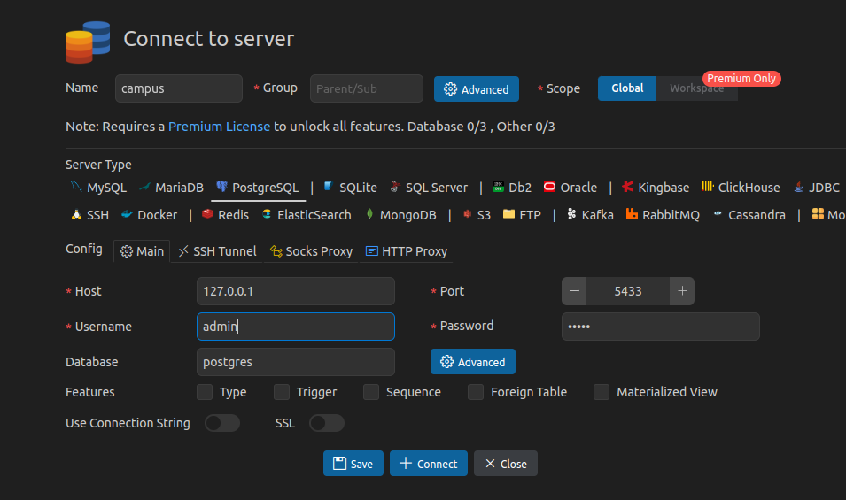

# PostgreSQL con Docker

## Creación del Contenedor 🙏🏻

 Este es el comenado que utilizamos en la terminal para crear el contenedor.

```bash
docker run -d --name postgres_container -e POSTGRES_USER=admin -e POSTGRES_PASSWORD=admin -e POSTGRES_DB=campus -p 5433:5432 -v pgdata:/var/lib/postgresql/data --restart=unless-stopped postgres:15
```

## Conectar al Contenedor de Docker
## Conectar con PostgreSQL bajo Consola
esto lo utilizamos despues  y deberias aparecer esto : "root@d696667a27d4:/#" y tocaria implementar lo de ' conectar con postgresSQL bajo consola'
```bash
docker exec -it postgres_container bash
```

## Conectar con PostgreSQL bajo Consola
aca hay dos tipos la forma larga y la forma corta 

forma larga: (esta es mas recomendable)
```bash
psql --host=localhost --username=admin -d campus --password
```
forma corta :

``` bash
psql -h localhost -U admin -d campus -W

```

despues de ejecutar ese codigo aparece el password y hay implementariamos segun el cual hayamos colocado en la parte superior en este caso es "admin"


### conexion con SQL,en la extension

toca instalar la extension asi mismo uno se mete:

1. toca cambiar el nombre de la base 
2. cambiar segun el lenguaje que vayamos a trabajar en este caso postgres 
3. colocamos el puerto que trabajamos que siempre es 5433
4. le colocamos el nombre de la base co la contraseña 
5. se le da en conect y save. 


### Para usuario por defecto
```bash
psql ... --username=postgres ...
```

## Comandos PSQL
- `\l` : Lista las bases de datos
- `\c {db_name}`: Cambiar a una base de datos existente

## Tipos de datos
### Tipos de Datos Numéricos

| Name               | Storage Size | Description                     | Range                                                        |
| ------------------ | ------------ | ------------------------------- | ------------------------------------------------------------ |
| `smallint`         | 2 bytes      | small-range integer             | -32768 to +32767                                             |
| `integer`          | 4 bytes      | typical choice for integer      | -2147483648 to +2147483647                                   |
| `bigint`           | 8 bytes      | large-range integer             | -9223372036854775808 to +9223372036854775807                 |
| `decimal`          | variable     | user-specified precision, exact | up to 131072 digits before the decimal point; up to 16383 digits after the decimal point |
| `numeric`          | variable     | user-specified precision, exact | up to 131072 digits before the decimal point; up to 16383 digits after the decimal point |
| `real`             | 4 bytes      | variable-precision, inexact     | 6 decimal digits precision                                   |
| `double precision` | 8 bytes      | variable-precision, inexact     | 15 decimal digits precision                                  |
| `smallserial`      | 2 bytes      | small autoincrementing integer  | 1 to 32767                                                   |
| `serial`           | 4 bytes      | autoincrementing integer        | 1 to 2147483647                                              |
| `bigserial`        | 8 bytes      | large autoincrementing integer  | 1 to 9223372036854775807                                     |

### Tipos de Datos de Caracteres

| Name                                               | Description                              |
| -------------------------------------------------- | ---------------------------------------- |
| `character varying(*`n`*)`, `varchar(*`n`*)`       | variable-length with limit               |
| `character(*`n`*)`, `char(*`n`*)`, `bpchar(*`n`*)` | fixed-length, blank-padded               |
| `bpchar`                                           | variable unlimited length, blank-trimmed |
| `text`                                             | variable unlimited length                |

### Tipos de Datos Booleanos

| Name      | Storage Size | Description            |
| --------- | ------------ | ---------------------- |
| `boolean` | 1 byte       | state of true or false |

### [Tipos de Datos de Fecha y Hora](https://www.postgresql.org/docs/current/datatype-datetime.html)

| Name                                          | Storage Size | Description                           | Low Value        | High Value      | Resolution    |
| --------------------------------------------- | ------------ | ------------------------------------- | ---------------- | --------------- | ------------- |
| `timestamp [ (*`p`*) ] [ without time zone ]` | 8 bytes      | both date and time (no time zone)     | 4713 BC          | 294276 AD       | 1 microsecond |
| `timestamp [ (*`p`*) ] with time zone`        | 8 bytes      | both date and time, with time zone    | 4713 BC          | 294276 AD       | 1 microsecond |
| `date`                                        | 4 bytes      | date (no time of day)                 | 4713 BC          | 5874897 AD      | 1 day         |
| `time [ (*`p`*) ] [ without time zone ]`      | 8 bytes      | time of day (no date)                 | 00:00:00         | 24:00:00        | 1 microsecond |
| `time [ (*`p`*) ] with time zone`             | 12 bytes     | time of day (no date), with time zone | 00:00:00+1559    | 24:00:00-1559   | 1 microsecond |
| `interval [ *`fields`* ] [ (*`p`*) ]`         | 16 bytes     | time interval                         | -178000000 years | 178000000 years | 1 microsecond |

### Tipos de Datos Monetarios

| Name    | Storage Size | Description     | Range                                          |
| ------- | ------------ | --------------- | ---------------------------------------------- |
| `money` | 8 bytes      | currency amount | -92233720368547758.08 to +92233720368547758.07 |

### [Tipos de Datos Binarios](https://www.postgresql.org/docs/current/datatype-binary.html)

Una cadena binaria es una secuencia de octetos (o bytes). Las cadenas binarias se distinguen de las cadenas de caracteres de dos maneras. Primero, las cadenas binarias permiten específicamente almacenar octetos con valor cero y otros octetos "no imprimibles" (generalmente, octetos fuera del rango decimal de 32 a 126). Las cadenas de caracteres no permiten octetos con valor cero, ni tampoco permiten cualquier otro valor de octeto y secuencias de valores de octetos que sean inválidos según la codificación del conjunto de caracteres seleccionados en la base de datos. En segundo lugar, las operaciones en cadenas binarias procesan los bytes reales, mientras que el procesamiento de cadenas de caracteres depende de la configuración regional. En resumen, las cadenas binarias son apropiadas para almacenar datos que el programador considera como "bytes en bruto", mientras que las cadenas de caracteres son apropiadas para almacenar texto.

El tipo `bytea` soporta dos formatos para entrada y salida: el formato "hex" y el formato "escape" histórico de PostgreSQL. Ambos formatos son siempre aceptados en la entrada. El formato de salida depende del parámetro de configuración `bytea_output`; el valor predeterminado es hex. (Tenga en cuenta que el formato hex se introdujo en PostgreSQL 9.0; las versiones anteriores y algunas herramientas no lo entienden).

| Name    | Storage Size                               | Description                   |
| ------- | ------------------------------------------ | ----------------------------- |
| `bytea` | 1 or 4 bytes plus the actual binary string | variable-length binary string |

### [Tipos de Datos de Redes](https://www.postgresql.org/docs/current/datatype-net-types.html)

| Name       | Storage Size  | Description                      |
| ---------- | ------------- | -------------------------------- |
| `cidr`     | 7 or 19 bytes | IPv4 and IPv6 networks           |
| `inet`     | 7 or 19 bytes | IPv4 and IPv6 hosts and networks |
| `macaddr`  | 6 bytes       | MAC addresses                    |
| `macaddr8` | 8 bytes       | MAC addresses (EUI-64 format)    |

## [Tipos de Datos Geométricos](https://www.postgresql.org/docs/current/datatype-geometric.html)

| Name      | Storage Size | Description                      | Representation                      |
| --------- | ------------ | -------------------------------- | ----------------------------------- |
| `point`   | 16 bytes     | Point on a plane                 | (x,y)                               |
| `line`    | 32 bytes     | Infinite line                    | {A,B,C}                             |
| `lseg`    | 32 bytes     | Finite line segment              | ((x1,y1),(x2,y2))                   |
| `box`     | 32 bytes     | Rectangular box                  | ((x1,y1),(x2,y2))                   |
| `path`    | 16+16n bytes | Closed path (similar to polygon) | ((x1,y1),...)                       |
| `path`    | 16+16n bytes | Open path                        | [(x1,y1),...]                       |
| `polygon` | 40+16n bytes | Polygon (similar to closed path) | ((x1,y1),...)                       |
| `circle`  | 24 bytes     | Circle                           | <(x,y),r> (center point and radius) |


### Tipos de Datos JSON y XML

- `json`: Datos en formato JSON
- `jsonb`: Datos JSON en un formato binario más eficiente
- `xml`: Datos en formato XML

### Tipos de Datos Especiales

- `uuid`: Identificador único universal
- `array`: Arreglos de cualquier tipo de datos
- `composite`: Tipo compuesto de varios tipos de datos
- `range`: Rango de valores

### Enumeradores
```pgsql
CREATE TYPE sexo AS ENUM('Masculino', 'Femenino', 'Otro');

CREATE TABLE camper(
    name varchar(100) NOT NULL,
    sexo_camper sexo NOT NULL
);
```